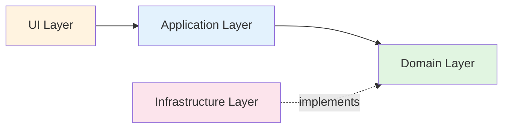

# DDD Layered Architecture

When structuring DDD applications, organize code into these layers



**Phase**: 🔨 implement

## User Interface Layer
**Contains:** Controllers, views, API endpoints, CLI
**Rules:** Thin; delegates to application services immediately

## Application Layer
**Contains:** Use case orchestration, transaction management
**Rules:** No business logic; coordinates domain objects and infrastructure
```ruby
# ✅ Application service: orchestrates, no business logic
class PlaceOrderUseCase
  def execute(cart_id:, customer_id:)
    cart = @cart_repo.find(cart_id)
    order = OrderFactory.create_from_cart(cart, customer_id)
    @order_repo.save(order)
    order.id
  end
end
```

## Domain Layer
**Contains:** Entities, value objects, aggregates, domain services, domain events
**Rules:** Pure Ruby; no framework or infrastructure dependencies
```ruby
# ✅ Domain layer: pure Ruby, no ActiveRecord
class Order
  def submit
    raise "Empty order" if @items.empty?
    @status = OrderSubmitted.new
  end
end
```

## Infrastructure Layer
**Contains:** Repositories (implementations), external API clients, persistence
**Rules:** Implements domain interfaces; depends on domain, not vice versa
```ruby
# ✅ Infrastructure implements domain interface
class PostgresOrderRepository < OrderRepository
  def save(order)
    # ActiveRecord/SQL lives here, not in domain
  end
end
```

## Critical Dependency Rule
**Dependencies point inward only.** Domain has zero external dependencies
```ruby
# ❌ WRONG: Domain depends on infrastructure
class Order < ActiveRecord::Base

# ✅ CORRECT: Infrastructure depends on domain
class ActiveRecordOrderRepository
  def save(order)  # order is a pure domain object
```
